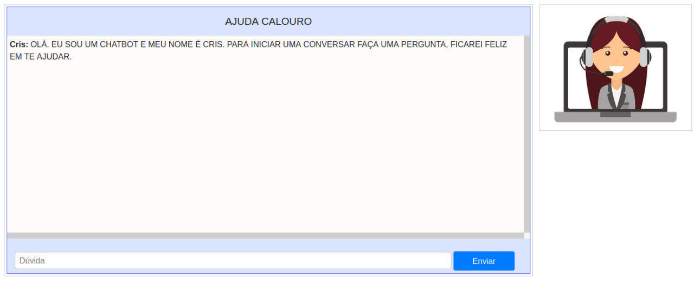

#### Projeto desenvolvido para a disciplina de Inteligência Artificial, ministrada pelo professor Evandro Barros e Giseldo Neo

## Instalando as dependências
$ git clone https://github.com/tips2/projeto-da-discplina-de-ia-me-ajuda.git

$ pip install -r requirements.txt

run client_web.py (python3 client_web.py)

acesse em seu navegador: http://127.0.0.1:5000/

Tip: Use o Pycharm
Tip: Microsoft Visual C++ 14.0 ou superior. Pegue com "Microsoft C++ Build Tools": https://visualstudio.microsoft.com/visual-cpp-build-tools/

## Tente on-line

Existe uma instância deste chatbot, com o conversor, já configurado para testes disponíveis em https://botcris.herokuapp.com

### Chatbot 

## Contact

Se você está com problemas, quer participar (código ou documentação), encontrou um bug ou até mesmo achou essa ideia legal entre em contato comigo ou abrir um problema, isso vai ajudar muito o projeto. 
 
e-mail: acng@ic.ufal.br, kab@ic.ufal.br, @nass@ic.ufal.br
